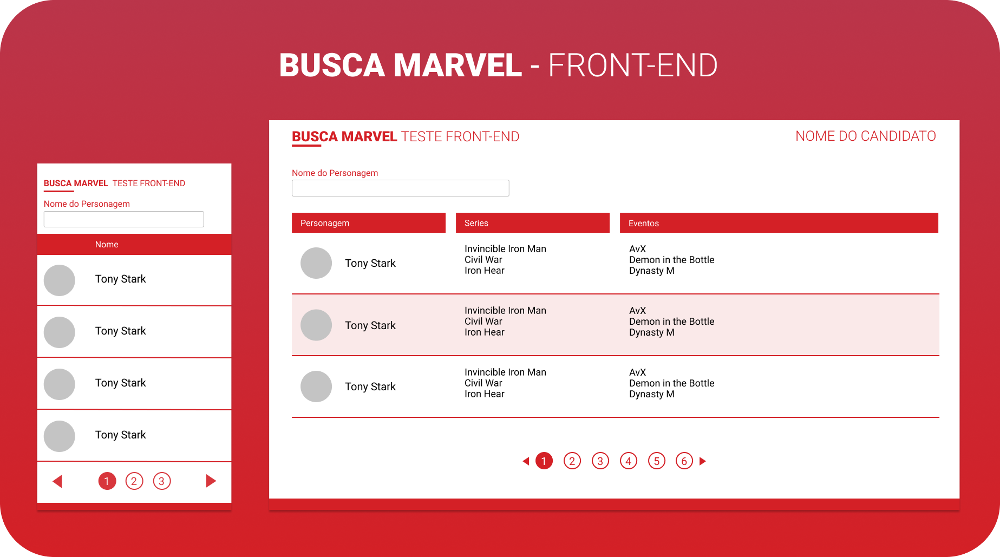

<p align="center">
  
</p>

<h1 align="center">
    Marvel Heroes App
</h1>

## 💻 Project

Uma aplicação simples que consome uma API da Marvel e faz a listagem dos Heróis, suas Series e Evetos.

## :rocket: Tecnologias

Tecnologias utilizadas:

- HTML
- CSS
- Typescript
- [Angular 12][angular]
- [SCSS][scss]

### Executar aplicação

```bash
# Clonar o repositório
$ git clone https://github.com/kelvisdev/marvel-heroes-app.git

# Instalar dependências
$ npm install

# Rodar aplicação
$ npm start
```


Made with ♥ by Kelvis Borges :wave: [Get in touch!](https://www.linkedin.com/in/kelvis-borges/)

[angular]: https://angular.io/
[scss]: https://sass-lang.com/documentation/syntax


